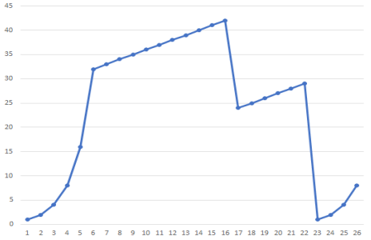

## 1

一、 请根据你在计算机通信与网络课程中所学习的知识填写表 1 中的空格，表 1 第一列为因特网协议栈的各层名称，第二列为各层可能存在的协议（仅需填写一个协议即可），第三列为已给出或你所填写的协议分组名称。（每空 1.5 分，共 12 分）

考点：[[1.3 层次化的网络体系结构|层次化网络体系结构]]

解析：

第三列确实有点难度。

| 层次名称                           | 协议举例                            | 协议分组名称                         |
| ------------------------------ | ------------------------------- | ------------------------------ |
| 应用层                            | <font color=#cc00cc>HTTP</font> | <font color=#cc00cc>报文</font>  |
| <font color=#cc00cc>运输层</font> | <font color=#cc00cc>TCP</font>  | 报文段                            |
| 网络层                            | <font color=#cc00cc>IP</font>   | <font color=#cc00cc>数据报</font> |
| <font color=#cc00cc>链路层</font> | 802.3                           | <font color=#cc00cc>帧</font>   |
| 物理层                            | 10Base-5                        | 比特流                            |

## 2

二、 在 CSMA/CD 中，在第 12 次碰撞后，节点选择 K=4 的概率有多大？结果 K=4 在 10Mbps 以太网上对应于多少秒的时延？（10 分）。

考点：[[5.2 多路访问链路和协议|CSMA/CD]]

解析：

从0到$2^{12}$选择K，所以概率为$\frac{1}{2^{12}}$，随机时长为$512\times 4=2KB$比特时间，对应：
$$
\frac{2\times 10^3}{10\times 10^6} = 2\times 10^{-4} = 0.2ms
$$
## 3

三、 考虑当浏览器发送一个 HTTP GET 报文时，通过 Wireshark 俘获到下列 ASCII 字符串（即这是一个 HTTP GET 报文的实际内容）。字符`<cr><lf>`是回车和换行符（即下面文本中的斜体字符串`<cr>`表示了单个回车符，该回车符包含在 HTTP 首部中的相应位置），根据该字符串，请回答下列问题。（每问 3分，共 15 分）

```html
GET /cs453/index.html HTTP/1.1<cr><lf>
Host: gaia.cs.umass.edu<cr><lf>
User-Agent: Mozilla/5.0 (Windows;U; Windows NT 5.1; en-US; rv:1.7.2) Gecko/20040804 Netscape/7.2 (ax) <cr><lf>
Accept:ext/xml, application/xml, application/xhtml+xml, text/html;q=0.9, text/plain;q=0.8,image/png,*/*;q=0.5<cr><lf>
Accept-Language:enus,en;q=0.5<cr><lf>
Accept-Encoding: zip,deflate<cr><lf>
Accept-Charset: ISO-8859- 1,utf-8;q=0.7,*;q=0.7<cr><lf>
Keep-Alive: 300<cr><lf>
Connection:keepalive<cr><lf>
<cr><lf>
```

(1)由浏览器请求的文档的 URL 是什么？
(2)该浏览器运行的 HTTP 是何种版本？
(3)该浏览器请求的是一条非持续连接还是一条持续连接？
(4)该浏览器所运行的主机的 IP 地址是什么？
(5)发起该报文的浏览器的类型是什么？

考点：[[2.2 HTTP：WEB应用|HTTP]]

解析：（这是作业原题啊）
1. http://gaia.cs.umass.edu/cs453/index.html
2. 1.1
3. 持续连接
4. 无从得知
5. Mozilla 5.0

## 4

四、 现有一个企业网络，其获得的网络地址为 11010110 01100001 11111100 00000000，其子网掩码为 11111111 11111111 11111100 00000000。

（1）该网络地址的点分十进制表示形式为_______________________________。 (2 分)

（2）假设该企业网络内部存在 A、 B、 C、 D 四个部门，部门 A 拥有 250 台 PC， 部门 B 拥有110 台 PC， 部门 C 拥有 110 台 PC， 部门 D 拥有 500 台 PC，现在要为每个部门分配 1 个子网，请进行子网规划，并以“IP 地址/前缀长度”形式给出各部门网络的网络地址，填入表 2 中。（8 分）

考点：[[4.2 IP协议与IP地址|IP地址]]、[[4.2 IP协议与IP地址|子网划分]]

解析：

1. 214.97.252.0
2. 下表：

|     | 网络地址/前缀长度         |
| --- | ----------------- |
| 部门A | 214.97.252.0/24   |
| 部门B | 214.97.253.0/25   |
| 部门C | 214.97.253.128/25 |
| 部门D | 214.97.254.0/23   |
## 5

五、 考虑图 1 的传输过程。假设 TCP Reno 是一个经历如下所示行为的协议，回答下列问题。在各种情况中，简要地论证你的回答。（14 分）

<font color=lightblue>经典老图</font>


（1） 指出 TCP 拥塞避免运行时的时间间隔。（4 分）

（2） 请问在第 18 个和第 24 个传输轮回里， ssthresh 的值分别设置为多少？ （4 分）

（3） 在哪个传输轮回内发送第 70 个报文段？ （2 分）

（4） 假定在第 26 个传输轮回后，通过收到 3 个冗余的 ACK 检测出有分组丢失，拥塞的窗口长度和 ssthresh 的值应当是多少？ （4 分）

考点：[[3.4 拥塞控制|拥塞控制]]

解析：

1. 6-16、17-22
2. 21（CongWin的一半）、14（CongWin的一半）
3. 慢启动期间，等比数列计算共发送63个报文段，第七十个报文段应在第7个传输轮回发送
4. ssthresh变为当前CongWin的一半，为4；CongWin设为新门限值+3，为7

## 6

六、 主机 A 和主机 B 之间采用 RDT3.0 进行数据可靠传输，假设信道带宽为 32kbps，其单向传播时延为 500ms，在不考虑确认帧的传输时延情况下，请问当数据帧长度为多少字节时，信道利用率为 20%？ 请给出详细计算步骤。（10 分）

考点：[[3.2 可靠数据传输|可靠数据传输]]、[[1.3 层次化的网络体系结构|时延]]

解析：

首先列方程解一下利用率为20%时的传输时延：
$$
\frac{x}{0.5+x} =  \frac15
$$
解得x=0.125s

因此发送的数据帧长度为：$0.125s\times 4Kbit=0.5KB=500Byte$

## 7

七、 主机 H1 通过图 2 所示的网络与主机 H2 通信。现 H1 需要将一个总长度为 5000 字节（含 20 字节 IP 首部）的初始 IP 报文传送给 H2，由于 ETH网络的 MTU 是 1500 字节，因此必须对该初始 IP 报文进行分片发送。

![[../image/2018-1.png]]

（1）该初始 IP 报文需要分成________________个分片 IP 报文发送。（1 分）

（2）设初始 IP 报文的 ID 为 134927，对分片之后的每个分片 IP 报文， 请填写表 3， 分别给出其IP 首部的 ID、 MF 位、 offset 段偏移、总长度字段的值。（8 分）

考点：[[5.3 交换局域网#以太网帧结构|以太网帧]]

解析：
1. 4片
2. 如下表：

| 分片序号 | ID     | MF  | Offset | 总长度  |
| ---- | ------ | --- | ------ | ---- |
| 1    | 134927 | 1   | 0      | 1500 |
| 2    | 134927 | 1   | 185    | 1500 |
| 3    | 134927 | 1   | 370    | 1500 |
| 4    | 134927 | 0   | 555    | 560  |

## 8

八、 假设你带着笔记本电脑回到宿舍， 通过有线的方式与以太网连接，并试图访问学校 HUB 系统主页（http://hub.hust.edu.cn， 假设浏览器和 WEB服务器均支持持久连接）。

（1） 从打开笔记本电脑电源到访问成功，发生的所有协议步骤是什么？ 请按序列写出。 假设当你给笔记本电脑加电时，在 DNS 或浏览器缓存中什么也没有。（提示：步骤包括使用以太网、 DHCP、ARP、 DNS、 TCP 和 HTTP 协议。）

（2） 明确指出在这些步骤中你如何获得网关路由器的 IP 和 MAC 地址。（20 分）

考点：[[5.4 大综合：Web页面的请求过程|大综合]]

解析：

#考前复习 

1. 按照[[5.4 大综合：Web页面的请求过程|老师讲的]]写即可
2. 网关路由器的IP地址由DHCP协议得到。笔记本发送DHCP广播请求，DHCP服务器收到请求后向请求报文中的源IP发送客户端IP地址、掩码、网关路由器IP地址等一系列数据。MAC地址则由ARP协议获得，笔记本广播ARP请求，其中源IP、源MAC为客户端的IP地址和MAC地址，目的IP为网关路由器IP地址，MAC地址为FF-FF-FF-FF-FF-FF。网关路由器收到ARP请求，解封装后检测到目的IP为自己的IP，便将自己的MAC地址填入源MAC地址，原路返回ARP响应。

